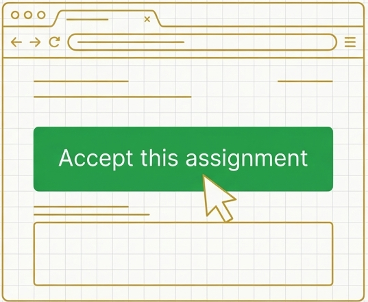

# ARCH Lab GitHub Classroom 📖 

Welcome to the **ARCH Lab** for systems-related courses.  
This space hosts programming projects, lab assignments, and supplemental materials used across various courses focusing on:

- Computer Architecture  
- Operating Systems  
- Embedded Systems  
- Systems Security  

---

## 📚 Currently Hosted Courses

- **ECE 590S - Platform and Systems Software​ Design**
- **ECE 690S - Platform and Systems Software​ Design**
- **CPEN 4700 - Computer Systems Architecture**
- **CPSC 5800 -  Advanced Topics in Systems Software**

---

## 🛠️ For Students

- Access your assigned repositories through GitHub Classroom links provided in the assignment (via Canvas).  
- Commit and push your work regularly.  
- Follow the project instructions in each repository’s README.

---

## Any Questions

Please use [this](https://github.com/orgs/ArchLabC/discussions/1) GitHub discussion forum for any questions related to any of the hosted classrooms.
